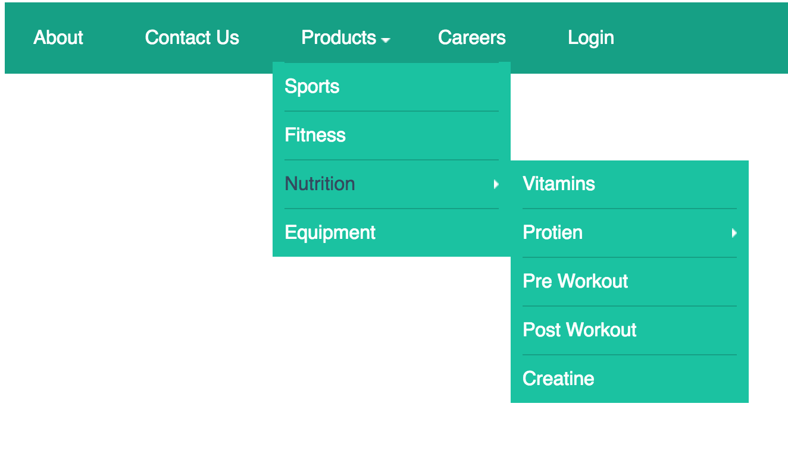
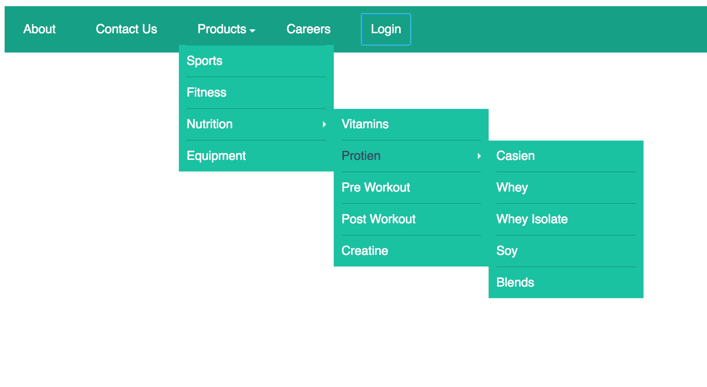

# Navigation bar with jQuery dropdown menu and sub menu

This is navigation bar with 3 levels of sub menus. 


#### Nav bar fully collapsed

#### 1st level sub menu on `:hover`

#### 2nd level sub menu on `:hover`

#### 3rd level sub meny on `:hover`


``` html
<li class="drop-down"> <a href="#">Products</a>
    <ul class="sub-menu">
        <li>
            <a href="#"></a>
        </li>
        <li><a href="#">Sports</a></li>
        <li><a href="#">Fitness</a></li>
        <li class="drop-down"> <a href="#">Nav 3.4</a>
            <ul class="sub-menu">
                <li><a href="#">Nav 3.4.1</a></li>
                <li class="drop-down"> <a href="#">Nav 3.4.2</a>
                    <ul class="sub-menu">
                        <li><a href="#">Nav 3.4.2.1</a></li>

```


``` javascript
$(function () {
    $('.drop-down').hover(function () {
        $(this).children('.sub-menu').slideDown(200);
    }, function () {
        $(this).children('.sub-menu').slideUp(200);
    })
})
```
